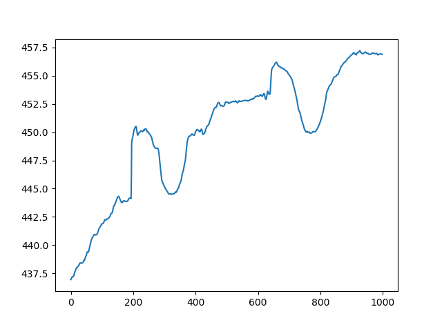
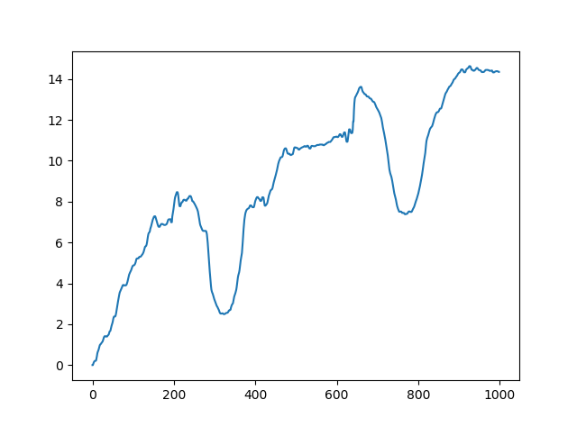

# profilometer-analysis
Code repo for AE2223-I, contains all the processing code to analyze raw profilometer data and reproduce the graphs found in the paper.

# WARNING : Outdated doc !
It will need to be rewritten in the near future. Right now just install the package by running `pip install -e .` in the root folder.
Then take a look at the scripts folder for some demonstrations of what this package can do. Make sure the raw files are in `scripts/data` and start by running `create_json.py`. Now with [3D Graphs !](http://nsarrazin.com/tire_demo)

Everything after this line is to be considered outdated.


## Raw data processing
A function `file_to_json` can be found in `jsonify.py`, this function reads a raw txt file outputted by the datalogger, and converts it to json to make it easier to work with. It can be called as follow:

For the afternoon file

```
$ python -c "from jsonify import file_to_json; file_to_json('Wheel8 Aternoon.txt', -3619682275.496, file_out='afternoon.json')"
```

For the morning file 

```
$ python -c "from jsonify import file_to_json; file_to_json('Wheel8 morning.txt', -3619671997.651, file_out='morning.json')"
```

## Analyzer
Once you obtained a json file, you can call the `Analyzer` class to start processing that data. it requires a couple things :
- a preprocessor function that reduces noise, smoothes out bumps in the raw data, etc. Those can be found in `preprocessing.py`
- a processor function that takes an array of depth values and return a single numerical value. A few can be found in `processing.py`
- A plot manager class, one can be found in `plotting.py`

Here's a basic demo of how it all comes together :
```python
from Analyzer import Analyzer

from processing import get_depth, get_std
from preprocessing import preprocessor_1
from plotting import PlotManager

analyzer = Analyzer(json_path='afternoon.json', preprocessor=preprocessor_1, processor=get_depth, plotter=PlotManager)
init_depth = analyzer.get_depth(0)
end_depth = analyzer.get_depth(10000)
print('Initial groove depth {}mm\nFinal groove depth {}mm'.format(round(init_depth,2), round(end_depth,2)))

z = analyzer.plotter.plot_slice_raw(6200)
plt.show()
z = analyzer.plotter.plot_slice_preprocessed(6200)
plt.show()
```

Which would return the following:
```
Initial groove depth -7.97mm
Final groove depth -2.25mm
```

As well as the two following graphs:

Raw slice                  |  Preprocessed
:-------------------------:|:-------------------------:
     |  

Because the preprocessor and processor attributes are functions, we can make use of lambdas to update some model parameters on the fly.

```python
t0, tf = 0, 10000
for threshold in [0.1, 0.25, 0.5, 1, 2.5, 8]:
    analyzer.preprocessor = lambda array : preprocessor_1(array, threshold=threshold) 

    depths = analyzer.get_depth_list((t0,tf), aliasing=100)
    plt.plot(depths, label="Threshold {}".format(threshold))

plt.xlabel("Time")
plt.ylabel("Groove depth [mm]")
plt.ylim([-10, 0])
plt.legend()
plt.show()
```